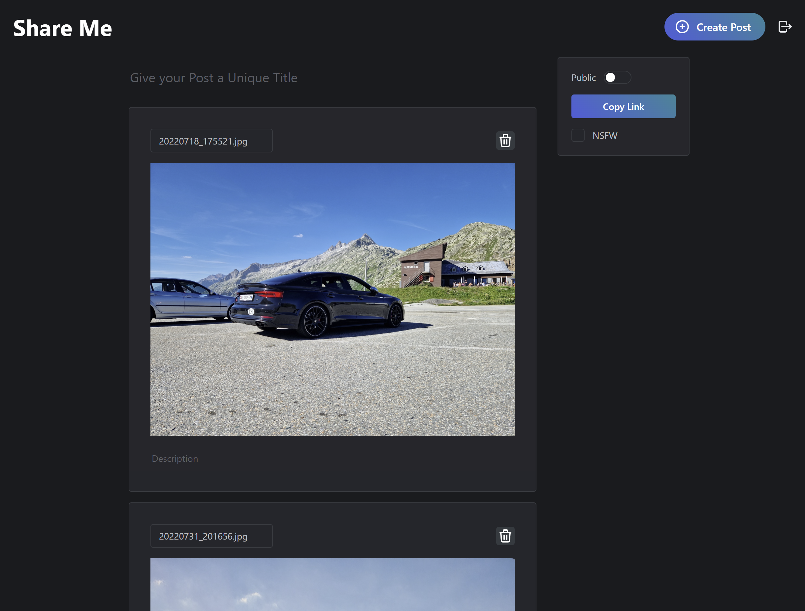

[](https://github.com/Dan6erbond/share-me/actions/workflows/main.yml)
[](https://github.com/Dan6erbond/share-me/releases/latest)
[](https://github.com/Dan6erbond/share-me/issues?q=is%3Aissue+is%3Aopen+sort%3Aupdated-desc)

# Share Me

A selfhosted image and video uploading platform that uses Next.js and PocketBase. An open-source alternative to Imgur.



## Features

- Sign-Up with Username/Email and Password
- Share Post URLs, Mark Post Public/NSFW
- Generate OpenGraph and Twitter Metadata for Social Media Embeds
  - Supports WhatsApp, Discord, Twitter, Facebook and More
- PocketBase Backend with Support for the Following:
  - OIDC Authentication
  - SMTP Mail Server for Verification Mails (WIP)
  - S3 Configuration for File Storage
  - Configurable File Size Limit
  - Fast Database Using SQLite
  - Admin UI and REST APIs with JavaScript and Dart Client SDKs

## Usage

Share Me can be deployed to your own infrastructure with Docker. For more information see [Deployment](#deployment).

Once the initial setup is complete, head to the URL of your Share Me instance. You will be redirected to /login if you aren't logged in yet. Alternatively, you can create an account under /sign-up.

To create posts simply go back to the homepage after logging in, and

## Deployment

Use the sample `docker-compose.yml` to deploy your Share Me instance. This will deploy a PocketBase server at port `:8080` and the Next.js frontend to `:3000`.

### PocketBase URL

You can set the PocketBase server URL with `host:port` in the `POCKETBASE_URL` environment variable or a hostname if deployed with a reverse proxy.

### Reverse Proxy

If you have a reverse proxy such as Traefik or Apache, you can expose the application under `/` and the PocketBase API under `/api/` as well as the admin UI under `/_/`. This will be the optimal setup for production. The `POCKETBASE_URL` should be set to `https://shareme.example.com`.

<details>
  <summary>Kubernetes Ingress Sample</summary>

```yml
apiVersion: networking.k8s.io/v1
kind: Ingress
metadata:
  name: share-me
spec:
  rules:
    - host: shareme.example.com
      http:
        paths:
          - backend:
              service:
                name: share-me-frontend
                port:
                  name: http
            path: /
            pathType: Prefix
          - backend:
              service:
                name: share-me-server
                port:
                  name: http
            path: /api/
            pathType: Prefix
          - backend:
              service:
                name: share-me-server
                port:
                  name: http
            path: /_/
            pathType: Prefix
```

</details>

## Configuration

### S3

S3 can be configured in PocketBase under Settings > Files storage. You can enable S3 and provide AWS S3 configurations or an S3-compatible API such as MinIO or DigitalOcean Spaces.

### SMTP

SMTP is used by Share Me for email verification (WIP). To configure a mail server head to Settings > Mail settings and configure your SMTP server.

### File Size Limit

The default file size limit is about 5MB and can be changed in the PocketBase UI. Head to Collections > files > Settings (cog icon) and edit the `file` column settings. Set the Max file size to whatever you want.

### Authentication

Share Me loads the configured PocketBase authentication providers. Head to your PocketBase admin dashboard, go to Settings > Auth providers and configure the ones you want to use.

To disable username/password and email/password login if you only want to allow access via SSO, go to Collections > users > Settings (cog icon) > Options and disable/enable the methods you want.

## Contributions

🚧 WIP

## License

This project is licensed under [MIT](./LICENSE).

## Support

<div style="display: flex; justify-content: center">

[](https://bmc.link/dan6erbond)

</div>
